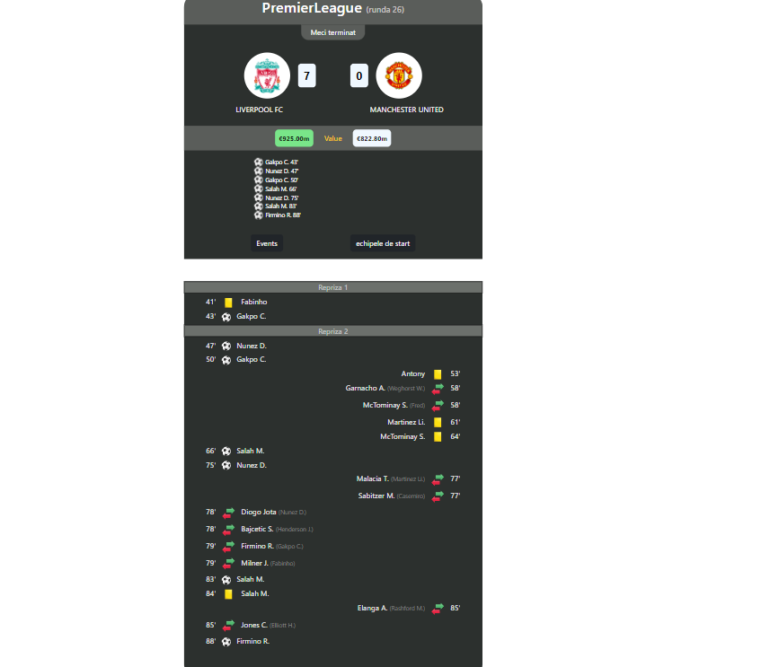
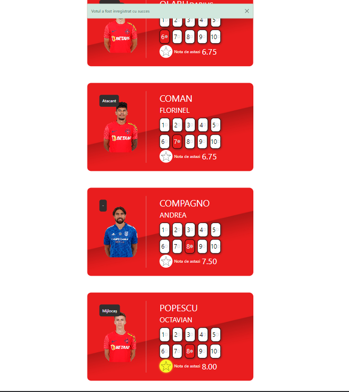
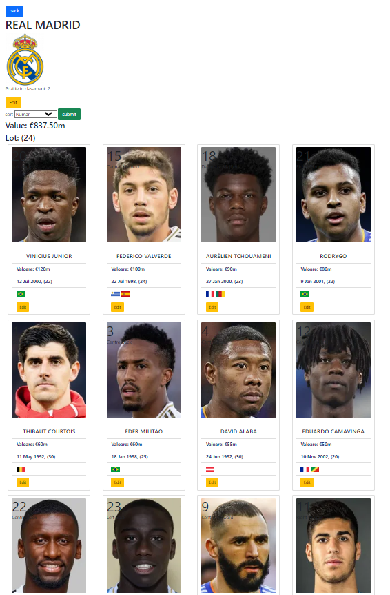
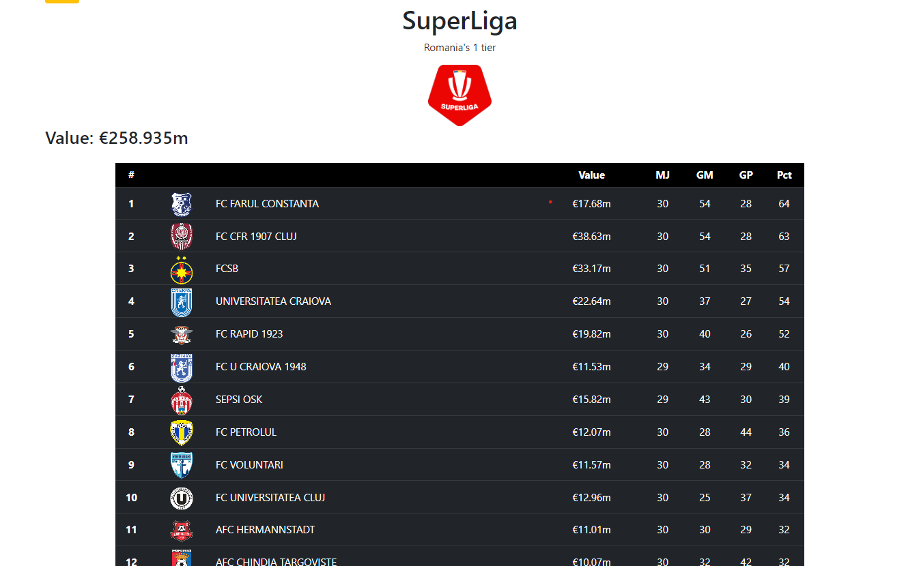

## TurboSport

## About

An application that can update matches, football teams, players and their values in real time using a web scrapper.
Every match has a rating section in which the user can give an individual rating for every player and can choose the man of the match.
Also the user can see the tables from different leagues

## Technologies used

The server implemneted in Node js using express, I used MongoDB as the database and Mongoose to implement it. In order to render the content I choose EJS.

## Screenshots

## The Match section

## The Rating section

## The Show Club section

## The League Table section

